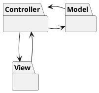
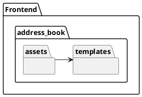
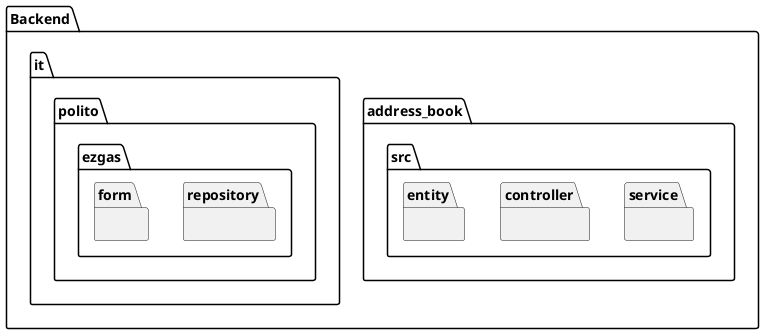
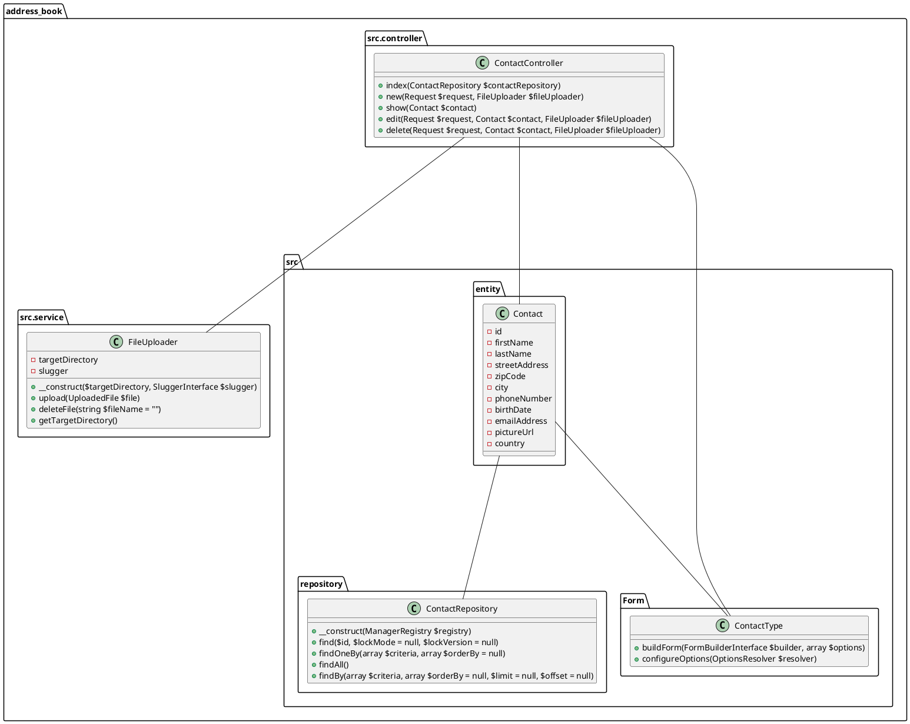

# Design Document 

Author: Tony Saliba

Date:09/12/2020

Version:1

# Contents

- [Design Document](#design-document)
- [Contents](#contents)
- [High level design](#high-level-design)
  - [Frontend](#frontend)
  - [Backend](#backend)
- [Low level design](#low-level-design)
<!-- - [Contents](#contents) -->
- [Design Document](#design-document)
- [Contents](#contents)
- [High level design](#high-level-design)
  - [Frontend](#frontend)
  - [Backend](#backend)
- [Low level design](#low-level-design)

# High level design 

The style selected is MVC. Clients can be smartphones, tablets, PCs.
The clients will access the application using only a browser. 

The system has three components: The View, which is developed with web technologies (JavaScript, HTML, CSS and Twig) and is in charge of collecting user inputs to send requests to the Controller; The Controller, which connects the view to the Model; The Model, which handles the system's business logic.

## Frontend

**Templates Package**

Contains the html.twig templates. 
Templates are the best way to organize and render HTML from inside our application.

**Assets Package** 

Contains .css style sheets that are used to render the GUI and .js script files to make our pages more responsive.

## Backend

**Entity Package**

Each Model class should have a corresponding class in this package. Model classes contain the data that the application must handle.
The various models of the application are organised under the model package.

In the Entity package all the Entities of the system are provided. Entities classes provide the model of the application, and represent all the data that the application must handle.

**Repository Package**

This package implements persistency for each Model class using an external database. 

For each Entity class, a Repository class is created (in a 1:1 mapping) to allow the management of the database where the objects are stored.

**Controller Package**

The controller package is in charge of handling the calls to the backend that are generated by the user's interaction with the GUI. The Controller package contains methods in 1:1 correspondance to the backend's available routes.

The controller layer interacts with the service layer to get a job done whenever it receives a request from the view.

**Service Package**

The service package collects the calls related to the management of a specific entity in the project.

# Low level design

